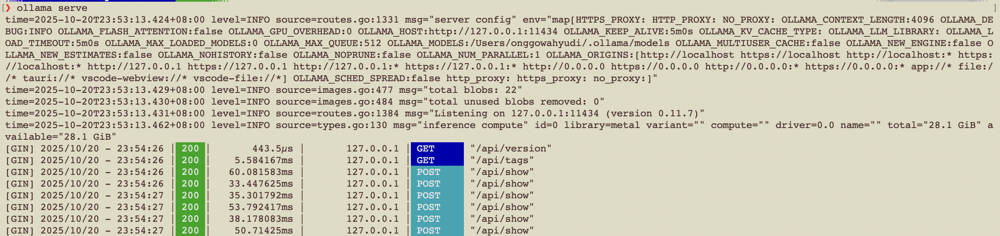
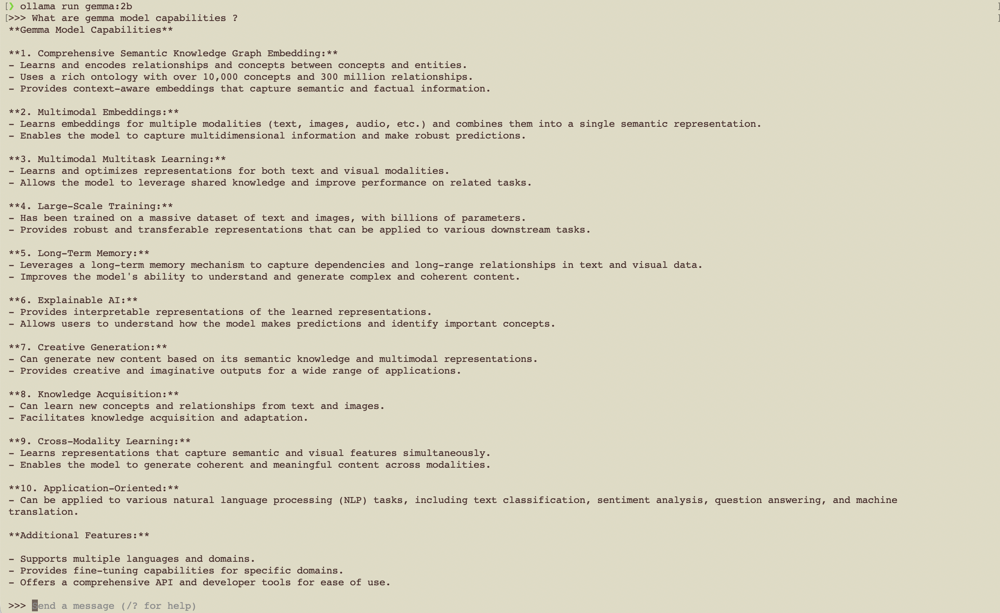
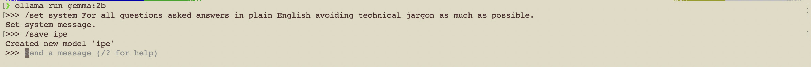
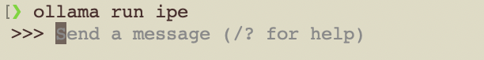
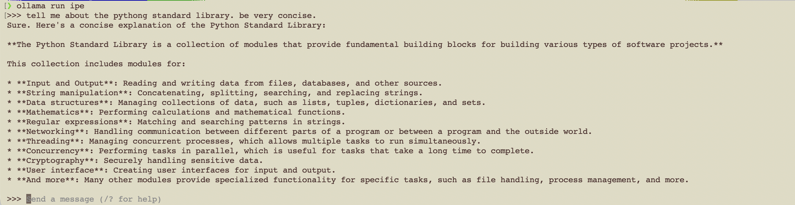
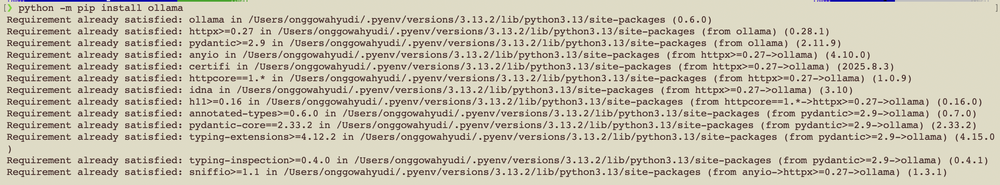
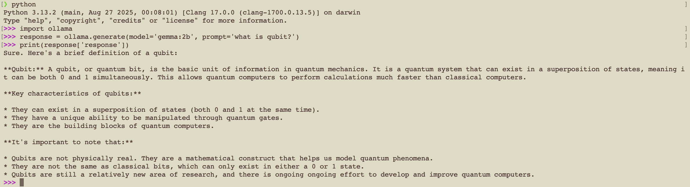
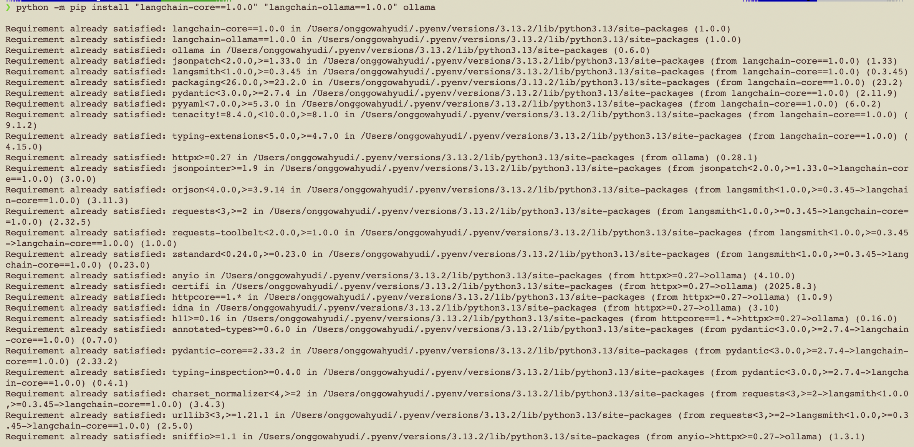

# Workshop - Self-Host I

## Install and Run Ollama Serve

# Workshop - Self-Host II

## ollama pull gemma:2b

# Workshop - Self-Host III

## ollama run gemma:2b

# Workshop - Self-Host IV

## Set system prompt and save the model with new name

## run new custom model

# Workshop - Self-Host V

## ollama with Python

### Install the ollama package for python

### Execute python code

# Workshop - Self-Host VI

### Install the langchain python library

### Install and run llama2
