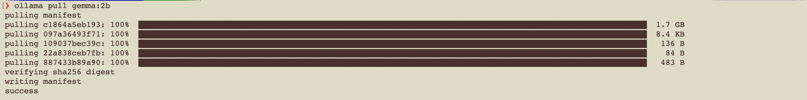
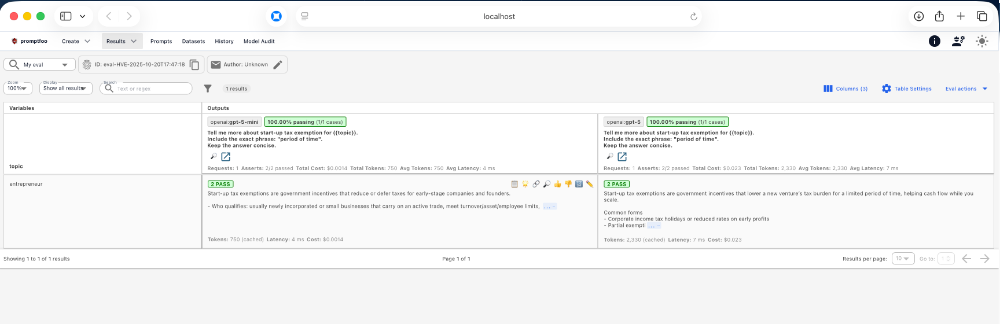

<h1>Introduction</h1>

This workshop result is submitted as part of an evaluation for Integrating and Deploying AI Solution course.

# Self-Host Workshop

## Workshop - Self-Host I

### Install and Run Ollama Serve

## Workshop - Self-Host II

### ollama pull gemma:2b

## Workshop - Self-Host III

### ollama run gemma:2b

## Workshop - Self-Host IV

### Set system prompt and save the model with new name

### run new custom model

## Workshop - Self-Host V

### ollama with Python

#### Install the ollama package for python

#### Execute python code

## Workshop - Self-Host VI

### Install the langchain python library

### Install and run llama2

### Ollama with python using langchain

# Testing Workshop

## Workshop – Prompt Testing I

### Install/verify/start promptfoo

## Workshop – Prompt Testing II

## Workshop – Prompt Testing III

### promptfoo eval - Test Negative Scenario, The output must less than 2000 tokens

### promptfoo eval - Test Positive Scenario, The output must less than 2500 tokens

### promptfoo view

## Workshop – Prompt Testing IV

# Token Monitoring Workshop

## Workshop – Monitoring LLM Token Usage I

### Install required packages

## Workshop – Monitoring LLM Token Usage II - III

## FastAPI with Token Metrics

## Workshop – Monitoring LLM Token Usage IV

## Run the App

## Workshop – Monitoring LLM Token Usage V

## Configuring Prometheus

## Configuring Docker Prometheus and Grafana

## Run Prometheus & Grafana in Docker

### Prometheus

### Grafana

# Langfuse Workshop

## Workshop – Langfuse I, II, III, IV, V

### Run python app

### Test Application

